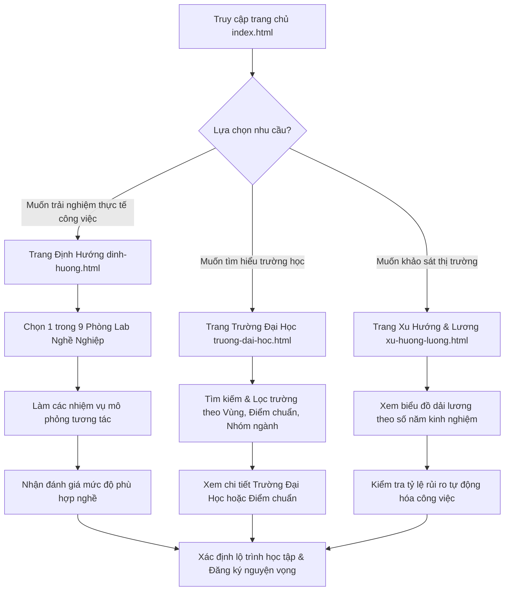

# 🧭 HướngNghiệpVN.online — Khám Phá Nghề Nghiệp & Định Hướng Tương Lai

[](https://huongnghiepvn.online)
[](https://developer.mozilla.org/en-US/docs/Web/HTML)
[](https://developer.mozilla.org/en-US/docs/Web/CSS)
[](https://developer.mozilla.org/en-US/docs/Web/JavaScript)

**HướngNghiệpVN.online** là một nền tảng web tương tác hiện đại, giúp học sinh THPT tại Việt Nam khám phá bản thân, trải nghiệm thực tế công việc và lựa chọn ngành học, trường Đại học phù hợp nhất với năng lực và xu hướng thị trường lao động.

---

## 🌟 Tính năng nổi bật

### 1. 🧪 9 Phòng Lab Nghề Nghiệp Tương Tác (Interactive Career Labs)
* Thay vì các câu hỏi trắc nghiệm lý thuyết khô khan, học sinh được trực tiếp đóng vai và giải quyết **3 nhiệm vụ thực tế** của từng nghề:
  * **AI & Khoa học máy tính Lab**: Thử nghiệm huấn luyện mô hình nhận diện vật thể (Object Detection).
  * **Y tế & Chăm sóc sức khỏe Lab**: Chẩn đoán lâm sàng dựa trên triệu chứng bệnh nhân.
  * **Pháp luật Lab**: Đóng vai luật sư biện hộ hoặc phân tích tình huống pháp lý cơ bản.
  * **Các Lab khác**: Cơ khí, Giáo dục, Kinh tế, Nông nghiệp, Thiết kế vi mạch, Tự động hóa, v.v.
* Giao diện mô phỏng trực quan, sinh động, dễ tiếp cận và không yêu cầu kiến thức chuyên môn từ trước.

### 2. 🏫 Cổng thông tin 300+ Trường Đại Học hàng đầu Việt Nam
* Cơ sở dữ liệu tuyển sinh liên tục được cập nhật từ cổng thông tin của Bộ GD&ĐT và các trường.
* Tra cứu thông tin chi tiết của 300+ trường Đại học danh tiếng trên cả nước: HUST, NEU, FTU, UMP, VNU, FPT, v.v.
* Hiển thị điểm chuẩn tuyển sinh qua các năm, học phí ước tính, ngành đào tạo thế mạnh, cơ sở vật chất và các đánh giá thực tế của sinh viên đi trước.

### 3. 🧠 Thuật Toán Gợi Ý Hướng Nghiệp 3 Tầng (14 Điểm)
* Tích hợp thuật toán định lượng chuyên sâu để tính toán ma trận độ phù hợp cá nhân hóa của học sinh đối với từng ngành nghề qua 3 tầng tiêu chí chặt chẽ:
  * **Tầng 1 (Tối đa 5 điểm)**: Độ tương thích tính cách Holland RIASEC (phân tích qua bộ câu hỏi trắc nghiệm).
  * **Tầng 2 (Tối đa 6 điểm)**: Độ tương thích tổ hợp môn học thế mạnh của bản thân học sinh.
  * **Tầng 3 (Tối đa 3 điểm)**: Trọng số năng lực học thuật thực tế dựa trên điểm học bạ hoặc điểm thi tốt nghiệp.
* Thuật toán tự động xếp hạng và đưa ra đề xuất Top 3 Phòng Lab nghề nghiệp phù hợp nhất cho người học.

### 4. 📊 Bản đồ Nhóm ngành & Tra cứu điểm chuẩn tuyển sinh
* Hệ thống phân loại nhóm ngành trực quan (Công nghệ, Kinh tế, Y tế, Xã hội, Giáo dục, Kỹ thuật...).
* Dự báo mức độ hot, điểm chuẩn trung bình và gợi ý danh sách các trường đào tạo tốt nhất tương ứng với từng nhóm ngành.

### 5. 📈 Dự báo xu hướng nghề nghiệp & Mức lương đến năm 2030
* Công cụ phân tích và dự báo thị trường lao động: các nhóm ngành triển vọng tăng trưởng cao và các nhóm ngành có nguy cơ bị thay thế bởi tự động hóa/AI.
* Bản đồ dải lương trung bình theo số năm kinh nghiệm giúp học sinh có cái nhìn thực tế về tương lai tài chính của ngành nghề đã chọn.

### 6. 🔌 Kiến trúc độc lập dữ liệu & Chi phí tối thiểu
* Sử dụng mô hình web tĩnh kết hợp với các tệp dữ liệu JSON mở, giúp trang web đạt tốc độ tải trang cực nhanh, bảo mật tối đa và hoạt động độc lập không phụ thuộc vào máy chủ cơ sở dữ liệu cồng kềnh.
* Chi phí duy trì hệ thống cực kỳ tối ưu (chỉ khoảng 230.000 VNĐ/năm cho tên miền), có thể chạy hoàn hảo trên các nền tảng hosting tĩnh miễn phí hoặc giá rẻ.

---

## 📂 Cấu trúc dự án

Dưới đây là cấu trúc các tệp tin và thư mục chính của hệ thống:

```text
huongnghiepvn/
├── .vscode/               # Cấu hình dự án cho VS Code
├── images/                # Hình ảnh và minh họa giao diện chung
├── logos/                 # Logo các trường đại học
├── LAB/                   # Các phòng Lab tương tác hướng nghiệp chi tiết
├── University/            # Chi tiết thông tin & điểm chuẩn của từng trường
│   ├── thong-tin-dai-hoc.html # Trang tra cứu và xem thông tin điểm chuẩn đại học
│   └── *-detail.html      # Trang thông tin chi tiết của từng trường cụ thể
├── recommend/             # Module và logic gợi ý nghề nghiệp học sinh (recommend.js)
├── daihoc.json            # Cơ sở dữ liệu thông tin trường Đại học (300+ trường)
├── diem_chuan_2025.json   # Dữ liệu điểm chuẩn tuyển sinh 2025
├── diem_chuan_filtered.json # Dữ liệu điểm chuẩn đã lọc để tìm kiếm tối ưu
├── nhomnganh.json         # Dữ liệu phân loại và triển vọng nhóm ngành
├── index.html             # Trang đích / Cổng thông tin hướng nghiệp chính
├── trang-chu.html         # Trang chủ điều hướng tin tức tổng hợp
├── dinh-huong.html        # Trang trắc nghiệm/lộ trình định hướng nghề nghiệp
├── goi-y.html             # Trang phân tích nguyện vọng và gợi ý học tập
├── nhom-nganh.html        # Trang tra cứu danh sách nhóm ngành nghề
├── truong-dai-hoc.html    # Trang tìm kiếm, lọc trường Đại học tuyển sinh
├── xu-huong-luong.html    # Trang biểu đồ thống kê xu hướng thu nhập ngành nghề
├── script.js              # Xử lý logic động (tìm kiếm, lọc, tương tác Labs)
└── styles.css             # Định nghĩa giao diện, responsive và hiệu ứng
```

---

## 🧭 Luồng Sử Dụng (User Flow)



1. **Bước 1: Khởi động & Khảo sát định hướng ban đầu**
   * Học sinh thực hiện bài kiểm tra tính cách Holland RIASEC để xác định 2 mã tính cách nổi trội nhất.
2. **Bước 2: Nhập thông tin học tập**
   * Học sinh nhập tổ hợp môn học sở trường và điểm học bạ/thi thử để thuật toán phân tích năng lực học thuật.
3. **Bước 3: Trải nghiệm thực tế (Phòng Lab)**
   * Học sinh vào phòng Lab được hệ thống gợi ý để trực tiếp thực hiện các nhiệm vụ mô phỏng, nhận báo cáo điểm mạnh/điểm yếu thực tế.
4. **Bước 4: Tra cứu tuyển sinh**
   * Dựa trên độ phù hợp %, học sinh tìm kiếm và lọc danh sách các trường đại học đào tạo, xem thông tin chi tiết về học phí, điểm chuẩn và đánh giá của sinh viên.
5. **Bước 5: Đưa ra chiến lược đăng ký nguyện vọng**
   * Học sinh tham khảo xu hướng lương và khả năng bị AI thay thế của ngành nghề để tối ưu hóa quyết định chọn trường, chọn ngành.

---

## 🛠️ Công nghệ sử dụng

Nền tảng được xây dựng tối giản, tối ưu hiệu năng tải trang và hiển thị mượt mà trên mọi thiết bị di động (Responsive Design):

* **Front-end**: HTML5, CSS3 (Modern Flexbox/Grid, Custom Properties, Glassmorphism, Micro-animations).
* **Back-end/Logic**: JavaScript thuần (Vanilla JS) xử lý thuật toán gợi ý 3 tầng, tìm kiếm thời gian thực (Real-time Filtering), mô phỏng logic nhiệm vụ tương tác, chuyển trang và lưu trạng thái người dùng.
* **Bộ Icon**: [Lucide Icons](https://lucide.dev)
* **Font chữ**: Google Fonts [Be Vietnam Pro](https://fonts.google.com/specimen/Be+Vietnam+Pro) - Đảm bảo hiển thị Tiếng Việt cực kỳ sắc nét, hiện đại.

---

## 🚀 Cài đặt & Chạy ứng dụng locally

Dự án sử dụng mã nguồn tĩnh (Static Web), không cần cài đặt các framework phức tạp hay cơ sở dữ liệu cồng kềnh.

1. **Tải mã nguồn về máy**:
   ```bash
   git clone https://github.com/your-username/huongnghiepvn.git
   cd huongnghiepvn
   ```
2. **Chạy ứng dụng**:
   * **Cách đơn giản nhất**: Click đúp vào file `index.html` (hoặc `trang-chu.html`) để mở trực tiếp trên trình duyệt.
   * **Cách chuyên nghiệp**: Sử dụng extension **Live Server** trên VS Code hoặc dùng một HTTP Server tĩnh bất kỳ (ví dụ: `python -m http.server 8000` hoặc `npx serve .`) để chạy ứng dụng dưới dạng local host.
