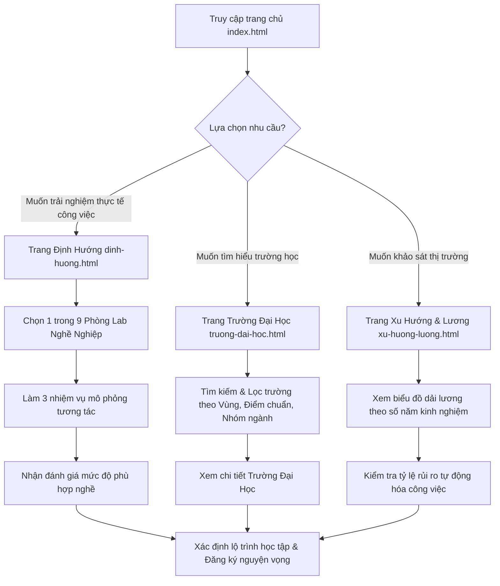

# 🧭 HướngNghiệpVN.online — Khám Phá Nghề Nghiệp & Định Hướng Tương Lai

[](https://huongnghiepvn.online)
[](https://developer.mozilla.org/en-US/docs/Web/HTML)
[](https://developer.mozilla.org/en-US/docs/Web/CSS)
[](https://developer.mozilla.org/en-US/docs/Web/JavaScript)

**HướngNghiệpVN.online** là một nền tảng web tương tác hiện đại, giúp học sinh THPT tại Việt Nam khám phá bản thân, trải nghiệm thực tế công việc và lựa chọn ngành học, trường Đại học phù hợp nhất với năng lực và xu hướng thị trường lao động.

---

## 🌟 Tính năng nổi bật

### 1. 🧪 9 Phòng Lab Nghề Nghiệp Tương Tác (Interactive Career Labs)
* Thay vì các câu hỏi trắc nghiệm lý thuyết khô khan, học sinh được trực tiếp đóng vai và giải quyết **3 nhiệm vụ thực tế** của từng nghề:
  * **AI & Khoa học máy tính Lab**: Thử nghiệm huấn luyện mô hình nhận diện vật thể (Object Detection).
  * **Y tế & Chăm sóc sức khỏe Lab**: Chẩn đoán lâm sàng dựa trên triệu chứng bệnh nhân.
  * **Pháp luật Lab**: Đóng vai luật sư biện hộ hoặc phân tích tình huống pháp lý cơ bản.
  * **Các Lab khác**: Cơ khí, Giáo dục, Kinh tế, Nông nghiệp, Thiết kế vi mạch, Tự động hóa, v.v.
* Giao diện mô phỏng trực quan, sinh động, dễ tiếp cận và không yêu cầu kiến thức chuyên môn từ trước.

### 2. 🏫 Cổng thông tin 20+ Trường Đại Học hàng đầu Việt Nam
* Cơ sở dữ liệu tuyển sinh liên tục được cập nhật.
* Tra cứu thông tin chi tiết của các trường danh tiếng: HUST, NEU, FTU, UMP, VNUHCM, FPT, v.v.
* Hiển thị điểm chuẩn trung bình, ngành đào tạo thế mạnh, cơ sở vật chất, học phí và các đánh giá thực tế của sinh viên đi trước.

### 3. 📊 Bản đồ Nhóm ngành & Tra cứu điểm chuẩn tuyển sinh
* Hệ thống phân loại nhóm ngành trực quan (Công nghệ, Kinh tế, Y tế, Xã hội, Giáo dục, Kỹ thuật...).
* Dự báo mức độ hot, điểm chuẩn trung bình và gợi ý danh sách các trường đào tạo tốt nhất tương ứng với từng nhóm ngành.

### 4. 📈 Dự báo xu hướng nghề nghiệp & Mức lương đến năm 2030
* Công cụ phân tích và dự báo thị trường lao động: các nhóm ngành triển vọng tăng trưởng cao và các nhóm ngành có nguy cơ bị thay thế bởi tự động hóa/AI.
* Bản đồ dải lương trung bình theo số năm kinh nghiệm giúp học sinh có cái nhìn thực tế về tương lai tài chính của ngành nghề đã chọn.

---

## 🧭 Luồng Sử Dụng (User Flow)



1. **Bước 1: Khám phá tổng quan (Trang Chủ)**
   * Học sinh lướt xem các thống kê nổi bật, các trường đại học hot nhất và định hình lộ trình định hướng nghề nghiệp.
2. **Bước 2: Trải nghiệm thực tế (Trang Định Hướng & Labs)**
   * Học sinh vào phòng Lab yêu thích làm các thử thách ngắn để kiểm tra sự hứng thú thực tế của bản thân với công việc đó.
3. **Bước 3: Lọc thông tin tuyển sinh (Trường Đại Học & Nhóm ngành)**
   * Sau khi chọn được ngành nghề, học sinh tra cứu các trường đại học có đào tạo ngành đó, lọc theo khu vực (Hà Nội, TP.HCM, Đà Nẵng...) và điểm chuẩn phù hợp với học lực bản thân.
4. **Bước 4: Tham khảo xu hướng & lương**
   * Đánh giá triển vọng nghề nghiệp lâu dài của ngành đã chọn để đưa ra quyết định vững chắc.

---

## 🛠️ Công nghệ sử dụng

Nền tảng được xây dựng tối giản, tối ưu hiệu năng tải trang và hiển thị mượt mượt trên mọi thiết bị di động (Responsive Design):

* **Front-end**: HTML5, CSS3 (Modern Flexbox/Grid, Custom Properties, Glassmorphism, Micro-animations).
* **Back-end/Logic**: JavaScript thuần (Vanilla JS) xử lý tìm kiếm thời gian thực (Real-time Filtering), mô phỏng logic nhiệm vụ tương tác, chuyển trang và lưu trạng thái người dùng.
* **Bộ Icon**: [Lucide Icons](https://lucide.dev)
* **Font chữ**: Google Fonts [Be Vietnam Pro](https://fonts.google.com/specimen/Be+Vietnam+Pro) - Đảm bảo hiển thị Tiếng Việt cực kỳ sắc nét, hiện đại.

---

## 🚀 Cài đặt & Chạy ứng dụng locally

Dự án sử dụng mã nguồn tĩnh (Static Web), không cần cài đặt các framework phức tạp hay cơ sở dữ liệu cồng kềnh.

1. **Tải mã nguồn về máy**:
   ```bash
   git clone https://github.com/your-username/huongnghiepvn.git
   cd huongnghiepvn
   ```
2. **Chạy ứng dụng**:
   * **Cách đơn giản nhất**: Click đúp vào file `index.html` (hoặc `trang-chu.html`) để mở trực tiếp trên trình duyệt.
   * **Cách chuyên nghiệp**: Sử dụng extension **Live Server** trên VS Code hoặc dùng một HTTP Server tĩnh bất kỳ (ví dụ: `python -m http.server 8000` hoặc `npx serve .`) để chạy ứng dụng dưới dạng local host.
